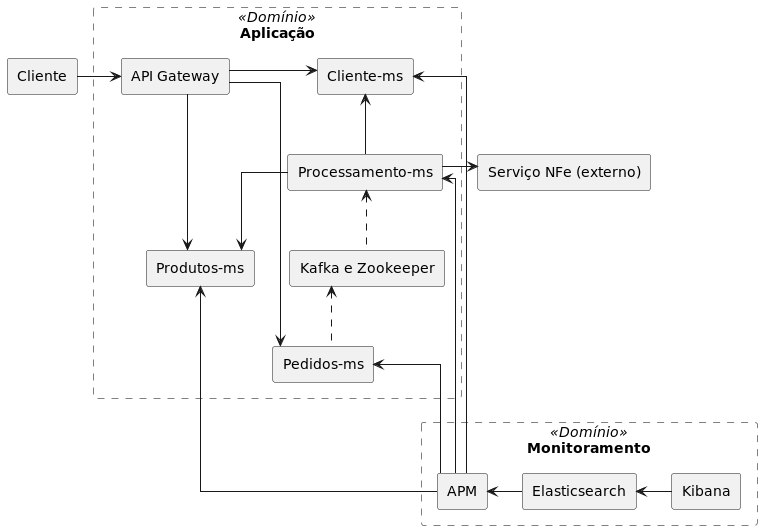
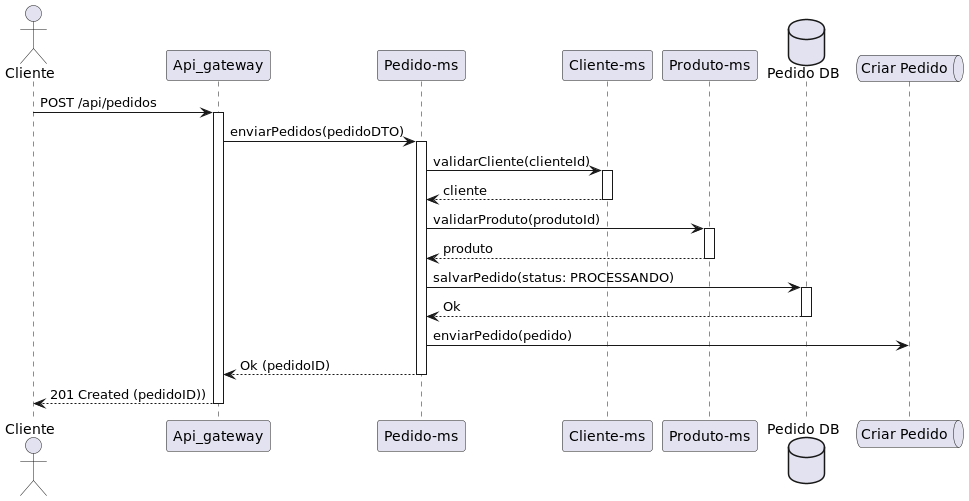
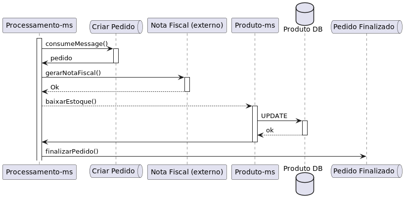

# Aceleração de Carreira Tech
## Coding Excellence linha 6 - Solução de Problemas

### Introdução

O objetivo deste desafio é a implementação e e utilização de ferramentas 
para encontrar e solucionar problemas técnicos. O Desafio consiste em implmentar um sistema
de centralização de Logs para um conjunto de microsserviços de um sistema de _e-commerce_
para a localização e resolução de um _bug_ no processamento de pedidos.

### Arquitetura
Neste desafio temos um conjunto de microsserviços que compoões um sistema de _e-commerce_
com a seguinte arquitetura:


**API-Gateway:** Serviço responsável por receber as requisições HTTP e repassar para o 
microsserviço correspondente. Também pode atuar como *firewall* e balanceador de carga.

**Cliente-ms:** Microsserviço que possui as informações referentes aos clientes do e-commerce

**Produtos-ms:** Microsserviço responsável pelas informações referentes aos produtos no e-commerce

**Pedidos-ms:** Microsserviço que gerencia os pedidos realizados no e-commerce

**Processamento-ms:** Microsserviço responsável pelo processamento dos pedidos do e-commerce

**MySQL:**: Container com o servidor de banco de dados que possui os 3 bancos de dados neessários
para os microsserviços: clientes, produtos e pedidos.

**Kafka e Zookeeper:** Sistema de filas e mensagens assíncronas para comunicação entre os microsserviços
de pedidos e processamento.

**Nota-Fiscal:** Serviço de geração da nota-fiscal eletrônica. Esse container é somente um mock para
representar um serviço externo de geração de nota-fiscal. Você não deve alterar nenhuma configuração
presente nele e nem guardar os logs provenientes dele.

**Filebeat:** Serviço de *shipper* para enviar e centralizar dados de Log em plataformas como Logstash e Elasticsearch. 
Se você optar pelo uso do File beat deverá configurá-lo no arquivo correspondente para coletar os Logs dos serviços.

**Elasticsearch:** mecanismo de busca e análise de dados distribuído, gratuito e aberto para todos os tipos de dados, incluindo textuais, numéricos,
geoespaciais, estruturados e não estruturados. No desafio será utilizado para armazenar os Logs coletados.

**Kibana:** O Kibana é uma interface de usuário gratuita e aberta para visualização de dados do Elasticsearch. Esse serviço
será utilizado para acessar e filtrar os logs armazenados.

### Montagem de Ambiente

Todos os serviços estão disponibilizados em forma de conteiners Docker e podem ser inicializados a 
partir do applicativo docker-compose (arquivo base de configuração já disponibilizado)
Portanto é necessário que você possua tanto o serviço do Docker quanto do docker-compose instalado
em sua máquina.

### Subindo a aplicação

Para construir todos os containers e iniciar a aplicação basta na pasta raiz deste diretório e 
executar o comando:

`docker-compose up`

e para interromper a execução (estando na pasta raíz) o comando:

`docker-compose down`

### Desafio

Neste desafio você deverá encontrar e solucionar o  *Bug* descrito abaixo no sistema.
Para isso implemente um sistema de Log nos microsserviços e uma estratégia para agregação de Logs para
facilitar a identificação do problema.

#### O *Bug*

O fluxo de atividades para a criação de um novo pedido envolve uma fila para comunicação assíncrona coforme os 
diagramas abaixo:




Atualmente o sistema está apresentando um problema no processamento de novos pedidos em duas situações:

##### Situação 1

Suponha que o produto X possua somente 1 unidade em estoque, caso seja enviada uma requsisição de
novo pedido com o *payload*: 

```json
{
   "cliente":"<Código do Cliente>",
   "produtos":[
      {
         "codigo":"Código do Produto X",
         "quantidade":"1"
      },
      {
         "codigo":"Código do Produto X",
         "quantidade":"1"
      }
   ]
}
```
O pedido é gerado com sucesso, porém ele fica no status `PROCESSANDO`, sem nunca ser concluído.

##### Situação 2
Suponha que o Produto X possui somente uma unidade em estoque, caso sejam enviados duas requesições de
novo pedido "quase simultâneas" e um dos pedidos tiver mais de 1 item, ambos os pedidos serão gerados, mas
somente um deles é concluído e o outro fica no status `PROCESSANDO` sem nunca ser concluído. 
Exemplo:

_Payload_ Requisição 1
```json
{
   "cliente":"<Código do Cliente A>",
   "produtos":[
      {
         "codigo":"Código do Produto X",
         "quantidade":"1"
      },
      {
         "codigo":"Código do Produto Y",
         "quantidade":"1" 
      }
   ]
}
```
_Payload_ Requsição 2
```json
{
   "cliente":"<Código do Cliente B>",
   "produtos":[
      {
         "codigo":"Código do Produto X",
         "quantidade":"1"
      }
   ]
}
```

Neste caso, se ambas as requisições forem enviadas dentro um mesmo intervalo de tempo,
ambos os pedidos serão gerados com sucesso (não haverá erro de falta de produto em estoque) porém um deles
ficará estagnado no status `PROCESSANDO`

#### Collection do Postman

Para facilitar os testes manuais, está sendo disponibilizada uma coleção do Postman
com exemplos de requisições para buscar um cliente, um produto e um pedido, além de do exemplo
de requisições da situação de erro descrita acima na criação de um pedido.

É importante ressaltar que embora os testes manuais sejam imortante nas investigação, 
uma vez indentificado o problema, é imprescindível a criação de um teste automatizado que o reproduza
para depois trabalhar na correção do problema.


#### Utilização de ferramenta de Log

Os microsserviçoes :`cliente-ms`, `produtos-ms`, `pedidos-ms` e `processamento-ms` não 
possuem nenhuma estratégia de Log implementada, faz parte do desafio que você adcione aos
serviços uma estratégia de log.

Uma possibilidade é utilizar uma ferramenta como Log4j ou Logback em
conjunto com a interface Slf4j e definir um `appender` das informaçãoes a serem 
logadas para o `stdout`. 
Outra opção é utilizar appender prontos como o ECS, basta incluir a dependência no 
arquivo `pom.xml` e criar o arquivo de configuração no pacote `resources`.

Uma vez configurados os sitemas de Log de cada serviço, para facilitar a investigação 
utilizamos alguma ferramenta para realizar a cetralização desses logs, facilitando a busca e o entendimento
conforme um caso de uso necessite da integração de mais de 1 microsserviço para a sua conclusão.

Você pode usar qualquer conjunto de ferramentas que julgar adequado para esta tarefa, porém
o repositório base desse deste desafio já contém uma pré-configuração utilizando: Filebeat,
Elasticsearch e Kibana. Você precisará somente criar o arquivo de configuração do Filebeat (`filebeat.yml`)
com as configurações necessárias para a aquisição dos logs e envio ao Elasticsearch.

Como um desafio extra você pode também tentar configurar uma ferramenta de *tracing* como  [Jaeger](https://www.jaegertracing.io/),
[OpenTelemetry](https://opentelemetry.io/) ou [Elastic APM](https://www.elastic.co/pt/observability/application-performance-monitoring) (que tem outras funcionalidades de monitoramento além de log e *tracing*).
Outra possibilidade é fazer o processamento de todos os logs para que estejam no formato JSON, o que facilita as
buscas pelos campos na ferramenta de agregação de logs.

### Submetendo a sua Solução

Quando você concluir o desafio, abra um Pull Request (PR) para a branch master
do repositório Base, assim outros desenvolvedores podem olhar e fazer uma revisão da
sua solução.